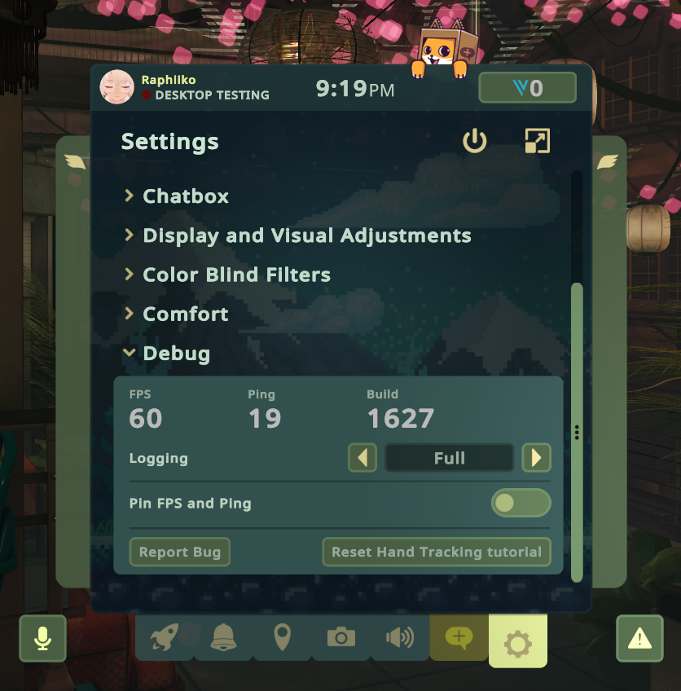

If you run into this issue, it means OyasumiVR was unable to find your VRChat log files, even though it detected that VRChat is running and should be generating them.

Various of OyasumiVR's features depend on reading VRChat's log files in order to function. Without access to these log files, you might experience issues such as invite requests not being automatically accepted.

### Enabling logging in VRChat

The most common reason for this to occur, is that logging has been either partially or fully disabled in VRChat. 

To enable logging, open the VRChat Quick Menu and navigate to the **Settings** tab. 
Scroll down all the way to the **Debug** section, and ensure the **Logging** option within it is set to **Full**.

### Cleaning up VRChat's old log files

More rarely, VRChat's log files may become corrupted or otherwise unusable. 
To resolve this, you can try deleting the old log files and restarting VRChat. 
This will allow VRChat to generate new log files. 

To do this:

1. Quit VRChat completely
2. Open the `C:\Users\%Username%\AppData\LocalLow\VRChat\vrchat` folder in your file explorer.
  1. You can do this by pressing `Windows + R`, typing `C:\Users\%Username%\AppData\LocalLow\VRChat\vrchat` into the dialog box, and pressing `Enter`.
3. Find all log files that start with `output_log_` and delete them.
4. Start VRChat again

:::note
At this point, it's good to double check if VRChat has indeed generated a new log file!
:::

If a new log file has been generated, OyasumiVR should now be able to read it.

### Still having issues? 

Please reach out on the [Discord](https://discord.gg/7MqdPJhYxC), or send me a direct message on @raphiiko!
Alternatively, feel free to message me on [Twitter/X](https://x.com/Raphiiko) or [Bluesky](https://bskyx.app/profile/raphii.co).
I'll be happy to help you debug the problem.