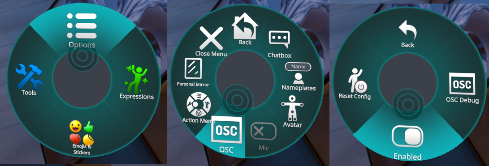

If you run into this issue, it means OyasumiVR detected VRChat is running, but was unable to detect VRChat's OSC(Query) services.

OyasumiVR communicates with VRChat over OSC and OSCQuery, and various of OyasumiVR's features depend on VRChat's OSC & OSCQuery services to function.
Without these services, these features will likely not work properly. 

### Enabling OSC in VRChat

The most common reason for this to occur, is that OSC has been disabled in VRChat. 

To enable OSC, open VRChat's action menu, go to **Options** > **OSC** and ensure the **Enable** option is checked.
If this option is already enabled, you can try disabling and re-enabling it.

### Still having issues? 

Please reach out on the [Discord](https://discord.gg/7MqdPJhYxC), or send me a direct message on @raphiiko!
Alternatively, feel free to message me on [Twitter/X](https://x.com/Raphiiko) or [Bluesky](https://bskyx.app/profile/raphii.co).
I'll be happy to help you debug the problem.