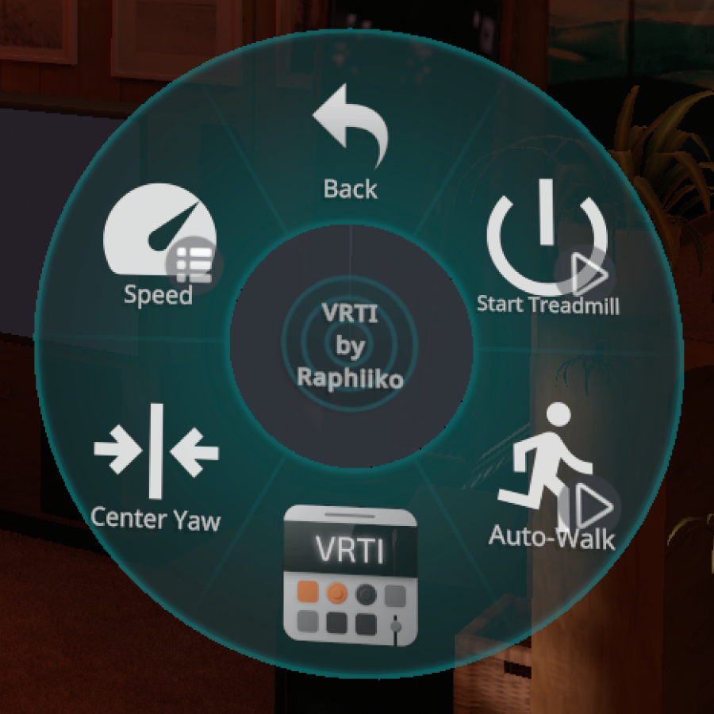
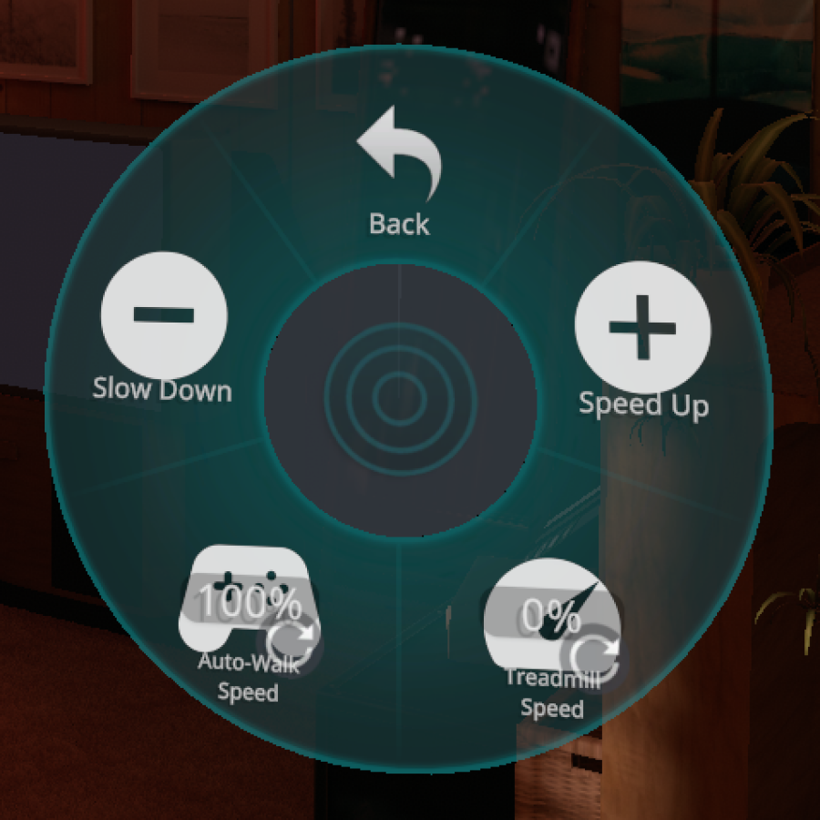

import { Badge, LinkButton } from "@astrojs/starlight/components";
import maLogoImage from "../../../../assets/ma_logo.png";
import "VRChat & OSC Control.scss";

VRTI itself can be controlled over OSC, allowing you to control your treadmill from external applications, like VRChat!
Below you will find several methods to control VRTI over OSC.

## VRChat

### VRTI Menu Avatar Prefab

The easiest way you can control VRTI from within VRChat, is by using VRTI's Menu Avatar Prefab.
You simply install it on your avatar using [Modular Avatar](https://modular-avatar.nadena.dev/): Just drag it onto your avatar, upload, and you're good to go!
This requires you to have Modular Avatar installed in your Unity project.

| Menu                                              | Speed Sub Menu                                                   |
| :------------------------------------------------ | :--------------------------------------------------------------- |
|  |  |

<LinkButton
  href="/files/VRTI_Menu.unitypackage"
  icon="right-arrow"
  variant="primary"
>
  Download VRTI Menu Avatar Prefab
</LinkButton>
<LinkButton
  href="https://modular-avatar.nadena.dev/"
  icon="external"
  variant="secondary"
>
  Get Modular Avatar
</LinkButton>

:::tip
Alternatively, VRTI also works with [FitOSC's avatar menu](https://duinrahaic.booth.pm/items/6189333)!
:::

### Avatar Parameters

In case you'd like to build your own controls, here's a list of the avatar parameters that VRTI will read and write to:

| Avatar Parameter Name                               | Value Type | Intended VRChat Menu Item |
| :-------------------------------------------------- | :--------- | :------------------------ |
| [`VRTI/Treadmill/Enable`](#vrtitreadmillenable)     | Boolean    | Toggle                    |
| [`VRTI/Treadmill/Speed`](#vrtitreadmillspeed)       | Float      | Radial Puppet             |
| [`VRTI/Treadmill/SpeedUp`](#vrtitreadmillspeedup)   | Boolean    | Button                    |
| [`VRTI/Treadmill/SlowDown`](#vrtitreadmillslowdown) | Boolean    | Button                    |
| [`VRTI/Walking/Enable`](#vrtiwalkingenable)         | Boolean    | Toggle                    |
| [`VRTI/Walking/Speed`](#vrtiwalkingspeed)           | Float      | Radial Puppet             |
| [`VRTI/Walking/YawReset`](#vrtiwalkingyawreset)     | Boolean    | Button                    |

## OSC Reference

When VRTI launches, it binds a random available UDP port to listen for incoming OSC messages.
As part of [OSCQuery](https://github.com/Vidvox/OSCQueryProposal), it advertises its OSC server over Zeroconf/MDNS with service name `_osc._udp.local`.
You will need to discover it to get the port number to send your OSC messages.

### OSCQuery

VRTI's [OSCQuery](https://github.com/Vidvox/OSCQueryProposal) server also binds to a random available TCP port.
It is advertised over Zeroconf/MDNS with service name `_oscjson._tcp.local`.

### OSC Addresses

Below you will find a list of all addresses you can write to.

:::note
All addresses have an additional alias prefixed with `/avatar/parameters`, to support being controlled from VRChat avatar parameters.

Example: `/avatar/parameters/VRTI/Treadmill/Enable` is an alias for `/VRTI/Treadmill/Enable`.
:::

#### /VRTI/Treadmill/Enable

**Value Type:** Boolean 
**Intended VRChat Menu Item:** Toggle

Starts your treadmill when set to `true`, and stops it when set to `false`.

#### /VRTI/Treadmill/Speed

**Type:** Float 
**Intended VRChat Menu Item:** Radial Puppet

Sets the target speed of your treadmill:

- A value of `1.0`, or 100% in VRChat's menu, corresponds to the maximum speed set in VRTI.
- A value of `0.0`, or 0% in VRChat's menu, corresponds to 0.5 km/h or 0.3 m/h.

#### /VRTI/Treadmill/SpeedUp

**Type:** Boolean 
**Intended VRChat Menu Item:** Button

When set to `1`, VRTI will increase the target speed of your treadmill by 0.5 km/h or m/h.

#### /VRTI/Treadmill/SlowDown

**Type:** Boolean 
**Intended VRChat Menu Item:** Button

When set to `1`, VRTI will decrease the target speed of your treadmill by 0.5 km/h or m/h.

#### /VRTI/Walking/Enable

**Type:** Boolean 
**Intended VRChat Menu Item:** Toggle

Enables auto-walk when set to `true`, and disables it when set to `false`.

#### /VRTI/Walking/Speed

**Type:** Float 
**Intended VRChat Menu Item:** Radial Puppet

Sets the auto-walk speed adjustment, allowing you to walk faster or slower in-game without changing your treadmill's speed.

- A value of `0`, or 0% in VRChat's menu, results in a **0x** multiplier.
- A value of `0.5`, or 50% in VRChat's menu, is the neutral position: **1.0x**.
- A value of `1.0`, or 100% in VRChat's menu, results in a **2.0x** multiplier.

#### /VRTI/Walking/YawReset <Badge size="large" variant="tip" text="VR Only" />

**Type:** Boolean 
**Intended VRChat Menu Item:** Button

Resets your walking direction to the direction you are currently are facing.

**Note:** This only has an effect while the yaw lock is enabled.
